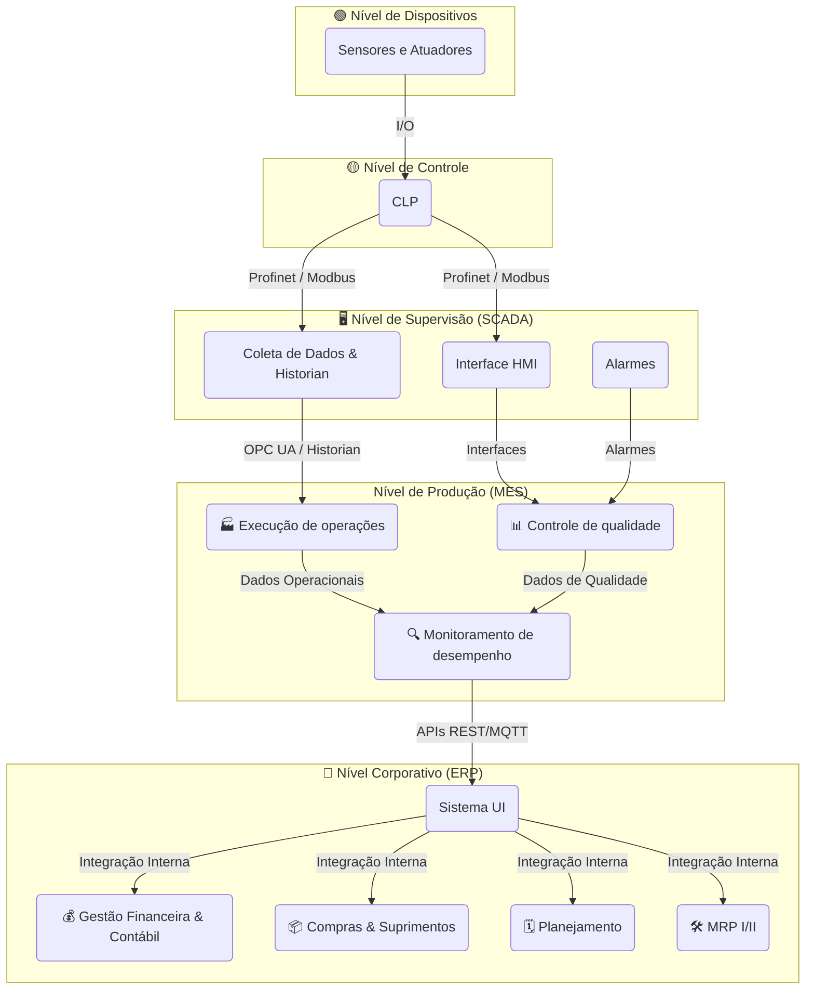

```mermaid
flowchart TD
    %% Nível de Dispositivos
    subgraph Nivel0["🟢 Nível de Dispositivos"]
      A("Sensores e Atuadores")
    end

    %% Nível de Controle
    subgraph Nivel1["🟡 Nível de Controle"]
      B("CLP")
    end

    %% Nível de Supervisão (SCADA)
    subgraph Nivel2["🖥️ Nível de Supervisão (SCADA)"]
      C1("Coleta de Dados & Historian")
      C2("Interface HMI")
      C3("Alarmes")
    end

    %% Nível de Produção (MES)
    subgraph Nivel3["Nível de Produção (MES)"]
      D1("🏭 Execução de operações")
      D2("📊 Controle de qualidade")
      D3("🔍 Monitoramento de desempenho")
    end

    %% Nível Corporativo (ERP)
    subgraph Nivel4["🏢 Nível Corporativo (ERP)"]
      E("Sistema UI")
      E1("💰 Gestão Financeira & Contábil")
      E2("📦 Compras & Suprimentos")
      E3("🗓️ Planejamento")
      E4("🛠️ MRP I/II")
    end

    %% Conexões entre os níveis
    A -->|I/O| B
    B -->|Profinet / Modbus| C1
    B -->|Profinet / Modbus| C2
    C1 -->|OPC UA / Historian| D1
    C2 -->|Interfaces| D2
    C3 -->|Alarmes| D2
    D1 -->|Dados Operacionais| D3
    D2 -->|Dados de Qualidade| D3
    D3 -->|APIs REST/MQTT| E
    E -->|Integração Interna| E1
    E -->|Integração Interna| E2
    E -->|Integração Interna| E3
    E -->|Integração Interna| E4
```
